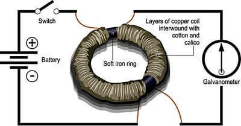
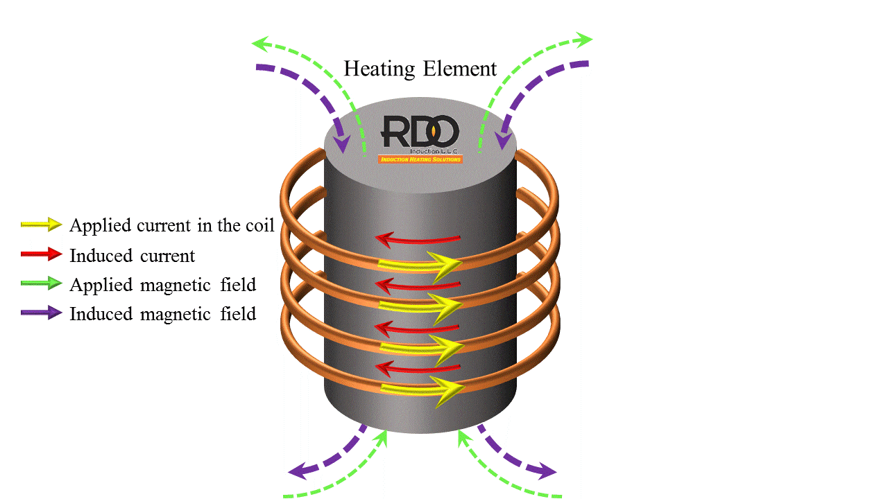
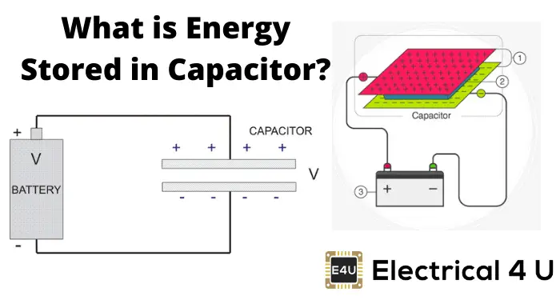
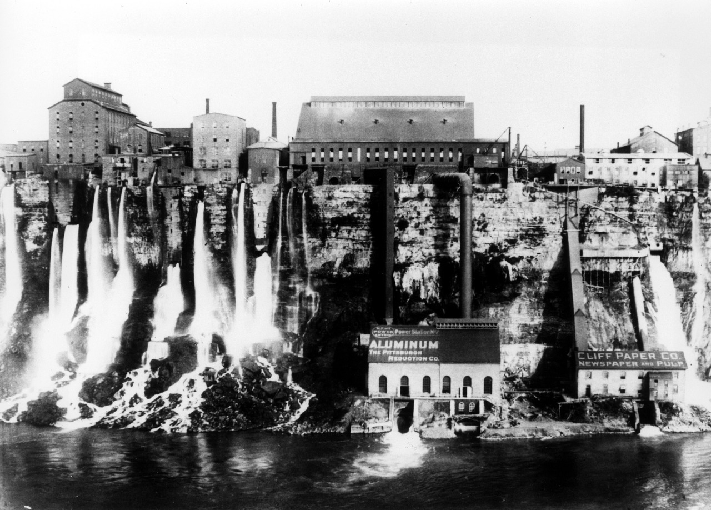
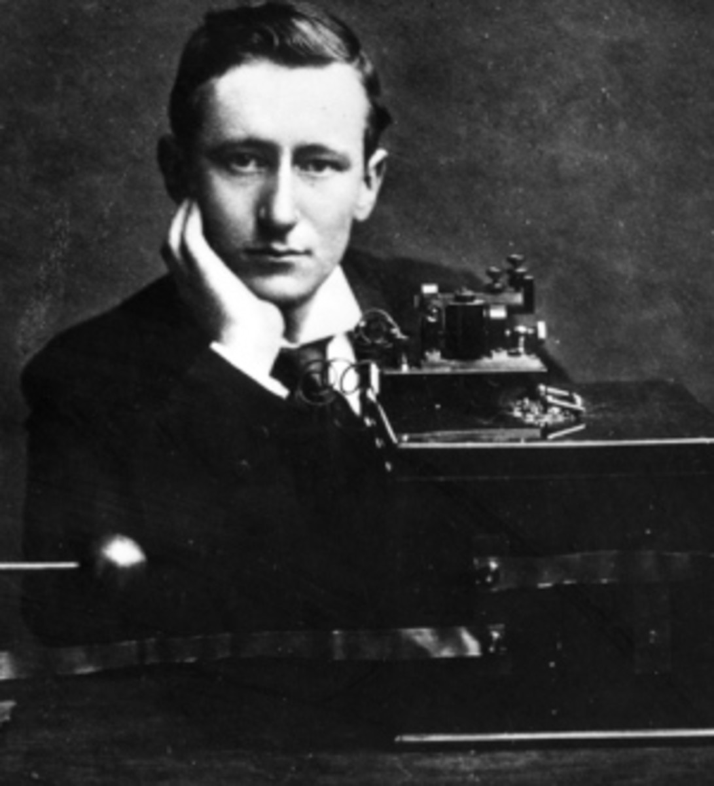

# A BRIEF STUDY INTO INDUCTANCE AND ENERGY STORAGE

**How Faraday's Law and Energy Conservation Principles Underpin the Design, Optimization, and Operation of Transformers and LC Oscillators**


*Faraday's iron ring apparatus showing primary coil, iron core, and galvanometer*

> "Nothing is too wonderful to be true, if it be consistent with the laws of nature."  
> — Michael Faraday, 1849

---

## Abstract

This study explores the fundamental physics governing inductance and energy storage in electromagnetic systems, with Faraday's Law of Induction and energy conservation as the analytical framework. Beginning with Faraday's 1831 discovery that changing magnetic flux induces voltage, we progress through the mathematical formulation of self-inductance, energy storage in magnetic fields, and the dual behavior of capacitors storing energy in electric fields.

The analysis then examines two critical applications: transformers (where mutual inductance enables efficient power transmission across 200+ years of electrical infrastructure) and LC oscillators (where complementary energy storage between inductors and capacitors created the foundation of wireless communication).

Mathematical derivations are presented not as isolated exercises, but as tools answering specific engineering questions: Why do transformers work? What determines resonant frequency? How much energy can be stored? What causes system failures?

---

## Recommended Background Video

**MIT OpenCourseWare - 8.02 Physics II: Electricity and Magnetism**  
Prof. Walter Lewin's lectures on electromagnetic induction, transformers, and LC circuits provide excellent visual demonstrations of the principles discussed in this document.  
[Watch on MIT OCW](https://ocw.mit.edu/courses/8-02-physics-ii-electricity-and-magnetism-spring-2007/)

---

## 1. The Problem: Power Transmission in the 1880s

On September 4, 1882, Thomas Edison threw a switch at Pearl Street Station in lower Manhattan, illuminating 59 customers with 400 electric lamps. It was the world's first commercial power station and it had a fatal flaw.

Edison's system generated **direct current at 110 volts**. The problem was not the DC itself but the voltage. Power loss in transmission lines follows:

```
P_loss = I² R
```

At low voltage, delivering even modest power requires high current. High current through resistance means enormous losses. Most of the power generated was wasted as heat in copper wires. Edison's system could only serve customers within about 1 mile of the generator. Beyond that, voltage drop made the lights too dim to be useful.

Copper costs made long-distance DC transmission economically impossible. If you wanted to power a city, you needed a generator in every neighborhood. If you wanted to power rural areas, you simply could not.

The solution to this problem - the technology that made the modern electrical grid possible - was invented in 1882 by Lucien Gaulard and John Gibbs, perfected by William Stanley in 1885, and is based entirely on a principle discovered 54 years earlier by Michael Faraday.

That principle is **electromagnetic induction**.

---

## 2. The Physical Setup: Faraday's Discovery (August 29, 1831)

Michael Faraday wound two separate coils of wire around opposite sides of an iron ring. He connected one coil (the primary) to a battery through a switch. He connected the second coil (the secondary) to a galvanometer, a sensitive current detector.

**What he expected:**  
Nothing. The two coils were electrically isolated. No charge could flow between them.

**What happened:**  
When he closed the switch, the galvanometer needle jumped sharply to one side, then immediately returned to zero, even though current continued flowing in the primary coil. When he opened the switch, the needle jumped in the opposite direction, then returned to zero again.

Current in coil 1 induced current in coil 2, but only during the moments of change.

This was **electromagnetic induction**. Faraday had discovered that:

1. A changing magnetic field creates an electric field
2. This electric field can drive current in a nearby conductor
3. The voltage induced is proportional to the rate of change of the magnetic field

This single observation is the foundation of every transformer, generator, and electric motor ever built.

---

## 3. Faraday's Law: Quantifying Electromagnetic Induction

### 3.1 The Law

The voltage (electromotive force, EMF) induced in a coil is proportional to the rate of change of magnetic flux through the coil:

```
ε = -N (dΦ_B/dt)
```

Where:
- ε = induced EMF (volts)
- N = number of turns in the coil
- Φ_B = magnetic flux through one turn (webers, Wb)
- dΦ_B/dt = rate of change of flux

The negative sign, added by Heinrich Lenz in 1834, indicates that the induced current creates a magnetic field opposing the change that caused it. This is Lenz's Law, a direct consequence of energy conservation. If the induced field aided the change, you could get free energy, violating thermodynamics.

### 3.2 What This Means for a Transformer

Consider two coils wrapped around the same iron core:

- Primary coil: N₁ turns, carrying AC current I₁(t)
- Secondary coil: N₂ turns, initially open circuit

The changing current in the primary creates a changing magnetic flux Φ_B(t) in the core. Both coils experience the same flux (assuming perfect coupling). By Faraday's Law:

```
ε₁ = -N₁ (dΦ_B/dt)    (primary)
ε₂ = -N₂ (dΦ_B/dt)    (secondary)
```

Dividing these equations:

```
V₂/V₁ = N₂/N₁
```

This is the **transformer equation**. The voltage ratio equals the turn ratio. A coil with 10 times more turns experiences 10 times higher voltage.

Since power must be conserved (in an ideal transformer), P_in = P_out:

```
V₁ I₁ = V₂ I₂

Therefore: I₂/I₁ = N₁/N₂
```

**Result:** If voltage steps up by a factor of 10, current steps down by a factor of 10. This is how transformers solve Edison's problem:

1. Generate power at moderate voltage (e.g., 2,400 V)
2. Step up to high voltage (e.g., 240,000 V) for transmission
3. Current drops 100 times, so I²R losses drop 10,000 times
4. Step down at destination to safe voltage (e.g., 120 V or 240 V)

This enabled the modern power grid.

---

## 4. Self-Inductance: Quantifying Opposition to Change

### 4.1 The Definition

When current through a coil changes, it creates a changing magnetic field that induces a voltage in the same coil, opposing the change. This property is called self-inductance, L, measured in henries (H).

The induced voltage is:

```
ε = -L (dI/dt)
```

Or equivalently:

```
L = N Φ_B / I
```

For a solenoid (long coil) with N turns, length ℓ, cross-sectional area A, and core material with permeability μ:

```
L = (μ N² A) / ℓ
```

Where μ = μ₀ μ_r:
- μ₀ = 4π × 10⁻⁷ H/m (permeability of free space)
- μ_r = relative permeability of core material
  - Air: μ_r ≈ 1
  - Iron: μ_r ≈ 1000 to 5000
  - Silicon steel: μ_r ≈ 4000 to 8000
  - Ferrite: μ_r ≈ 100 to 3000

### 4.2 Why L is Proportional to N²

Doubling the number of turns has two effects:

1. Each turn contributes to the total flux: Φ_total ∝ N
2. Each turn experiences the total flux: ε_total ∝ N

Combined: L ∝ N × N = N²

**Engineering consequence:** Inductance scales with the square of turns. This is why power transformers use thousands of turns, and why adding an iron core (increasing μ by 1000 times) is so effective.

### 4.3 Historical Note: Joseph Henry's Independent Discovery

In 1832, American physicist Joseph Henry discovered electromagnetic induction independently, months before Faraday published. However, Henry delayed publication while teaching at Albany Academy. The unit of inductance, the henry, honors his contribution.

By a tragic irony, Henry's discovery of self-inductance was more thorough than Faraday's, but Faraday published first. The law bears Faraday's name; the unit bears Henry's.


*Electromagnetic induction in action: applied current creates magnetic field, inducing current in the workpiece*

---

## 5. Energy Stored in an Inductor

### 5.1 The Derivation

Building up current in an inductor requires work against the self-induced back-EMF. The instantaneous power required is:

```
P = ε · I = L (dI/dt) · I
```

The total energy stored when current increases from 0 to I is:

```
E_L = ∫ L I dI  (from 0 to I)
E_L = (1/2) L I²
```

This energy is stored in the magnetic field. When the current decreases, this energy is recovered (or dissipated as heat in resistance).

### 5.2 Magnetic Field Energy Density

The energy stored in a magnetic field per unit volume is:

```
u_B = B² / (2μ₀)
```

For a solenoid with field B = μ₀ n I (where n = N/ℓ is turns per unit length):

```
E_L = u_B · Volume = [B²/(2μ₀)] · Aℓ = (1/2) L I²
```

This confirms the energy formula from a field perspective.

### 5.3 How Large Is This Energy?

**Example:** A distribution transformer with L = 85 H carrying I = 12 A at peak:

```
E_L = (1/2) (85) (12)² = 6,120 J = 6.12 kJ
```

This is substantial energy. For comparison:
- A 9mm bullet: approximately 500 J
- A car moving at 1 m/s: approximately 500 J
- This transformer: 6,120 J

If the circuit opens suddenly (e.g., blown fuse), this energy must dissipate. Without a safe path, it creates enormous voltage spikes, potentially thousands of volts, that can arc through insulation, destroy windings, and cause fires.

**Engineering solution:** Transformers use surge arresters (metal oxide varistors, MOVs) and RC snubber circuits to provide safe discharge paths during transients.

---

## 6. Energy Stored in a Capacitor: The Complementary Form


*Energy stored in a capacitor: electric field between charged plates*

### 6.1 The Equation

A capacitor stores energy in the electric field between its plates. The energy stored is:

```
E_C = (1/2) C V²
E_C = (1/2) Q²/C
```

Where:
- C = capacitance (farads, F)
- V = voltage across capacitor (volts)
- Q = charge stored (coulombs)

### 6.2 The Symmetry

Notice the mathematical parallel:

**Property | Inductor | Capacitor**
- Storage medium: Magnetic field | Electric field
- Energy formula: E_L = (1/2) L I² | E_C = (1/2) C V²
- Opposes change in: Current | Voltage
- Voltage across: V = L(dI/dt) | V = Q/C
- Current through: I | I = C(dV/dt)

This duality is not coincidence. It is a consequence of the symmetry between electric and magnetic fields in Maxwell's equations. In LC circuits, energy oscillates between these two forms.

---

## 7. Mutual Inductance: The Physics of Transformers

### 7.1 The Definition

When two coils share magnetic flux, changing current in one induces voltage in the other. The mutual inductance M relates them:

```
ε₂ = -M (dI₁/dt)
```

For two coils with self-inductances L₁ and L₂:

```
M = k √(L₁ L₂)
```

Where k is the coupling coefficient, 0 ≤ k ≤ 1:
- k = 1: Perfect coupling (all flux from coil 1 links coil 2)
- k = 0: No coupling (coils are magnetically isolated)
- k ≈ 0.98 to 0.995: Typical for iron-core transformers
- k ≈ 0.3 to 0.6: Typical for air-core coils

### 7.2 Transformer Efficiency

Real transformers achieve 98 to 99.5% efficiency in large units. Losses come from four sources:

**1. Copper losses (I²R):** Resistance in windings dissipates energy as heat. Minimized by using thick wire with low resistance.

**2. Core losses (hysteresis):** Magnetizing and demagnetizing the iron core each AC cycle requires energy. Minimized by using silicon steel or amorphous metal.

**3. Eddy current losses:** Changing flux induces currents in the core itself, which dissipate as heat. Minimized by laminating the core into thin sheets (0.3 to 0.5 mm) insulated from each other.

**4. Flux leakage:** Not all flux from primary links secondary (k < 1). Minimized by tight winding geometry and closed iron path.

Modern power transformers achieve k > 0.98 and total efficiency exceeding 99%.

---

## 8. Worked Example: Niagara Falls Power Station (1895)


*Historic Niagara Falls Power Station - first large-scale AC power transmission system using transformers*

### 8.1 The Problem

In 1895, Westinghouse Electric built generators at Niagara Falls producing 2,200 V AC. The goal was to transmit power 26 miles to Buffalo, NY. At 2,200 V, losses would be prohibitive. The solution: step up voltage for transmission, then step down for use.

**Transmission voltage:** 11,000 V  
**Building supply voltage:** 220 V

### 8.2 The Calculation

**Step-up transformer (at the station):**

```
N₂/N₁ = V_trans/V₁ = 11000/2200 = 5

Turn ratio: 1:5 (step up to 11 kV)
```

**Step-down transformer (in Buffalo):**

```
N₄/N₃ = V₃/V_trans = 220/11000 = 1/50

Turn ratio: 50:1 (step down to 220 V)
```

### 8.3 Power Loss Reduction

Consider transmitting 1 MW (1,000,000 W) over 26 miles (42 km) of copper wire with total resistance R = 10 Ω:

**At 2,200 V:**
```
I = P/V = 1,000,000/2,200 = 455 A
P_loss = I² R = (455)² (10) = 2,070,000 W
```
Over twice the useful power is lost as heat!

**At 11,000 V:**
```
I = P/V = 1,000,000/11,000 = 91 A
P_loss = I² R = (91)² (10) = 82,810 W
```
Only approximately 8% lost.

By stepping voltage up 5 times, current drops 5 times, and resistive losses (I²R) drop by 25 times.

### 8.4 Historical Impact

The Niagara Falls project proved that AC transmission with transformers was economically viable for long distances. Within a decade:

- 1893: 100,000 lights at Chicago World's Fair powered by AC
- 1896: Niagara-Buffalo line operational
- 1900: AC systems spreading across North America and Europe
- 1907: Edison himself abandoned DC in favor of AC for long-distance transmission

Faraday's Law, discovered in 1831, enabled the electrical grid that powers the modern world.

---

## 9. LC Oscillations: Energy Exchange and Resonance


*LC oscillator circuit diagram showing series and parallel configurations with resonant frequency formula*

### 9.1 The Physical Setup

Connect a charged capacitor to an inductor. What happens?

**t = 0:** Capacitor fully charged to V₀. All energy in electric field: E_C = (1/2) C V₀², I = 0.

**t = T/4:** Capacitor discharges through inductor. Current reaches maximum I₀. All energy in magnetic field: E_L = (1/2) L I₀², V = 0.

**t = T/2:** Inductor's collapsing field charges capacitor with opposite polarity. All energy back in electric field: E_C = (1/2) C V₀², I = 0.

**t = 3T/4:** Capacitor discharges again, current flows in opposite direction. E_L = (1/2) L I₀², V = 0.

**t = T:** Back to initial state. The cycle repeats.

This is **LC oscillation**. Energy sloshes back and forth between electric and magnetic forms at a specific frequency.

### 9.2 The Resonant Frequency

The frequency of oscillation is determined entirely by L and C:

```
f₀ = 1 / (2π√(LC))
```

Or in angular frequency:

```
ω₀ = 1 / √(LC)
```

**Key insight:** The resonant frequency is independent of the initial energy. A weakly charged capacitor oscillates at the same frequency as a strongly charged one. Only the amplitude differs.

### 9.3 Energy Conservation

In an ideal LC circuit (no resistance), total energy remains constant:

```
E_total = E_L + E_C = constant
```

The time evolution is:

```
E_L(t) = (1/2) L I₀² cos²(ω₀ t)
E_C(t) = (1/2) C V₀² sin²(ω₀ t)
```

Where energy conservation requires: L I₀² = C V₀²

Using cos²θ + sin²θ = 1:

```
E_total = E_L(t) + E_C(t) = (1/2) L I₀² = (1/2) C V₀² = constant
```

This is one of the most elegant demonstrations of energy conservation in physics.

---

## 10. Worked Example: Designing an AM Radio Tuner

### 10.1 The Problem

AM radio broadcasts in the frequency range 540 kHz to 1600 kHz (medium wave). A radio receiver uses an LC circuit to select one station by tuning to its frequency. The inductor is fixed at L = 220 μH. What range of capacitance is needed?

### 10.2 The Calculation

From the resonance equation:

```
f = 1 / (2π√(LC))

Rearrange: C = 1 / (4π² f² L)
```

**At the low end (f_min = 540 kHz):**

```
C_max = 1 / (4π² (540 × 10³)² (220 × 10⁻⁶))
C_max = 1 / (2.524 × 10⁹) = 397 pF
```

**At the high end (f_max = 1600 kHz):**

```
C_min = 1 / (4π² (1600 × 10³)² (220 × 10⁻⁶))
C_min = 1 / (2.211 × 10¹⁰) = 45.2 pF
```

**Required capacitance range:** 45 pF to 397 pF

### 10.3 Engineering Implementation

This is exactly how the tuning dial on a vintage radio works:

- Variable capacitor with two sets of interleaved metal plates
- Rotating the knob changes the overlap area, changing capacitance
- At minimum overlap: C ≈ 45 pF, resonates at 1600 kHz (high end)
- At maximum overlap: C ≈ 400 pF, resonates at 540 kHz (low end)
- Each station broadcasts at a specific frequency; the LC circuit's resonance selects which one you hear

Modern radios use varactor diodes (voltage-controlled capacitors) for electronic tuning, but the principle is identical.

---

## 11. Historical Turning Point: Marconi's Transatlantic Signal (1901)


*Guglielmo Marconi with his wireless telegraph equipment at Signal Hill, Newfoundland (1901)*

### 11.1 The Impossible Achievement

On December 12, 1901, at Signal Hill in St. John's, Newfoundland, Guglielmo Marconi listened through headphones attached to a 200-foot antenna wire held aloft by a kite. He heard three faint clicks, the Morse code letter S (dot-dot-dot), transmitted from Poldhu, Cornwall, England.

**Distance:** 3,500 km (2,200 miles) across the Atlantic Ocean  
**Frequency:** approximately 800 kHz (wavelength approximately 375 meters)  
**Power:** approximately 25 kW at the transmitter

Many scientists, including Lord Kelvin, had declared this impossible. Radio waves travel in straight lines; the curvature of the Earth would block signals beyond the horizon (about 30 km at sea level).

Marconi succeeded because radio waves reflect off the ionosphere, a layer of ionized gas 80 to 400 km above Earth that acts as a mirror for certain frequencies. He did not know the ionosphere existed (it was not discovered until 1902), but he proved long-distance wireless communication was possible.

### 11.2 The LC Circuit That Made It Work

**Transmitter (Poldhu):**
- Spark-gap oscillator creates RF pulses at approximately 800 kHz
- LC tank circuit (inductor + capacitor) sets the frequency
- Antenna radiates electromagnetic waves
- Telegraph key breaks transmission into dots and dashes (Morse code)

**Receiver (Newfoundland):**
- 200-foot wire antenna captures electromagnetic waves
- LC tuned circuit resonates at 800 kHz, rejecting other frequencies
- Coherer detector converts RF to DC pulses
- Headphones make the pulses audible

The LC resonant circuit was critical for selectivity, separating the desired 800 kHz signal from noise and interference.

### 11.3 Consequences

- 1906: Reginald Fessenden transmits the first voice and music broadcast using continuous-wave transmission
- 1920: KDKA Pittsburgh begins regular radio broadcasting (first commercial station)
- 1930s: Every home has a radio, all using LC tuned circuits
- Today: WiFi, Bluetooth, cell phones, GPS, radar all use LC resonators for frequency generation and selection

Marconi's achievement launched the wireless age. The principle that made it possible, LC resonance, was discovered by Heinrich Hertz in 1887, based on theory developed by James Clerk Maxwell in the 1860s.

---

## 12. Quality Factor: Selectivity and Damping

### 12.1 Real LC Circuits Have Resistance

In a real LC circuit, the inductor's wire has resistance R. This dissipates energy as heat. The oscillation gradually decays:

```
E(t) = E₀ exp(-R t / 2L)
```

The quality factor Q measures how many oscillations occur before energy drops to 1/e (37%) of initial value:

```
Q = (ω₀ L) / R
Q = (1/R) √(L/C)
Q = f₀ / Δf
```

Where Δf is the bandwidth (frequency range with power ≥ 50% of peak).

### 12.2 Interpretation

**High Q (Q > 100):** Sharp resonance, narrow bandwidth, slow decay
- Good for radio tuning (separate closely spaced stations)
- Bad for broadband filters (need wide frequency response)

**Low Q (Q < 10):** Broad resonance, wide bandwidth, fast decay
- Good for pulse circuits (fast response)
- Bad for frequency selection (poor rejection of nearby signals)

**Examples:**
- AM radio tuner: Q ≈ 50 to 200
- FM radio tuner: Q ≈ 20 to 50 (stations more widely spaced)
- Quartz crystal oscillator: Q > 10,000 (extremely stable frequency)
- GPS clock: Q ≈ 100,000 (atomic precision required)

---

## 13. Failure Case Study: When Resonance Becomes Dangerous

### 13.1 Failure Mode 1: Transformer Ferroresonance

**Scenario:**  
A large transformer is connected to a long underground power cable. The cable has significant capacitance (approximately 0.1 to 0.3 μF per km). The transformer is lightly loaded or even open-circuited.

**What happens:**  
The transformer's magnetizing inductance (L_m) resonates with the cable capacitance (C_cable). If the resonant frequency happens to be at 60 Hz (or a harmonic like 180 Hz), the resonance can sustain itself indefinitely, fed by the AC source.

**Consequences:**
- Overvoltage: 150 to 250% of rated voltage
- Core saturation leading to extreme magnetizing current
- Overheating of windings and core
- Insulation breakdown and failure

**Real incident:**  
In 2003, a 13.8 kV distribution transformer in California experienced ferroresonance after a fault cleared, leaving it connected to a long cable with no load. Voltage peaked at 32 kV (230% overvoltage). The transformer failed catastrophically, starting a fire.

**Solution (IEC 60076, IEEE C57 standards):**
- Avoid operating transformers below 25% rated load on long cables
- Install damping resistors to increase R and lower Q
- Use surge arresters to clamp overvoltages
- Monitor for unusual harmonic content (signature of ferroresonance)

### 13.2 Failure Mode 2: LC Voltage Amplification

**Scenario:**  
A parallel LC circuit is driven at its resonant frequency. At resonance, the impedance of L and C are equal in magnitude but opposite in phase. In a parallel configuration, impedance is maximized:

```
Z_resonance = Q · X_L = Q · ω₀ L
```

**Voltage amplification:**

```
V_C = Q · V_source
```

If Q = 100 and V_source = 10 V, then V_C = 1000 V, enough to destroy semiconductor components rated for 50 V.

**Real incident:**  
In the 1990s, an RF amplifier circuit for a cellular base station used an LC filter at the output. A manufacturing defect created an unintended parallel resonance at the operating frequency. The filter's capacitors were rated for 100 V; at resonance with Q ≈ 80, they experienced 1600 V and exploded.

**Solution:**
- Limit Q < 10 in power circuits using damping resistors
- Avoid parallel resonance at operating frequencies
- Use snubber networks (RC circuits) across inductive loads
- Calculate all resonant frequencies during design phase

---

## 14. Summary of Investigation

| Investigation Stage | Law or Principle Applied | Key Finding |
|---------------------|-------------------------|-------------|
| Faraday's discovery 1831 | Electromagnetic induction | Changing flux induces voltage |
| Self-inductance definition | Faraday's Law | L = NΦ/I determines opposition to change |
| Energy in inductor | Energy conservation | E_L = (1/2) L I² stored in magnetic field |
| Energy in capacitor | Energy conservation | E_C = (1/2) C V² stored in electric field |
| Transformer operation | Mutual inductance | M = k√(L₁ L₂) enables power transfer |
| Transformer turn ratio | Faraday's Law | V₂/V₁ = N₂/N₁ and I₂/I₁ = N₁/N₂ |
| Transformer efficiency | Faraday plus Lenz plus design | 98 to 99.5% with laminated core and copper optimization |
| Niagara Falls 1895 | Voltage transformation | 26-mile transmission made economically viable |
| LC resonance | Energy oscillation | f₀ = 1/(2π√LC) determines frequency |
| Marconi's radio 1901 | LC oscillator | Wireless communication across 3500 km |
| Quality factor Q | Damping and selectivity | Q = ω₀L/R determines bandwidth |
| Ferroresonance failure | Resonance plus saturation | Overvoltage destroys transformer |
| Voltage amplification failure | Parallel resonance | V_C = Q × V_source destroys components |

---

## 15. Conclusion

Faraday's Law and energy conservation principles are not confined to textbook problems. In transformers and LC oscillators, they are the governing physics, the reason a transformer can step 240 kV down to 120 V with 99% efficiency, and the reason Marconi could transmit wireless signals across the Atlantic in 1901.

Faraday's Law quantifies how changing magnetic flux creates voltage, the principle that powers every transformer in the global electrical grid, from power stations stepping up voltage to 765 kV for transmission, to phone chargers stepping down 120 V to 5 V for USB.

Energy conservation explains why LC circuits oscillate at a precise frequency determined solely by L and C values, enabling every radio, every WiFi router, every smartphone, and every wireless device.

The design results here (optimal turn ratios, resonant frequencies, energy storage capacities) are not engineering guesses. They are direct mathematical consequences of laws discovered in the 1830s. The failure cases show that when these principles are ignored or allowed to degrade, systems fail in precisely the way the physics predicts.

Faraday discovered induction with a coil, an iron ring, and a galvanometer. Every transformer and oscillator built since has been built, whether the engineer knew it or not, with Faraday and conservation of energy.

---

## References and Further Reading

### Primary Sources
- Faraday, M. (1831). Experimental Researches in Electricity. Philosophical Transactions of the Royal Society of London.
- Henry, J. (1832). On the Production of Currents and Sparks of Electricity from Magnetism. American Journal of Science.
- Lenz, H. F. E. (1834). On the Determination of the Direction of Induced Galvanic Currents. Annalen der Physik und Chemie.

### Historical Accounts
- Hughes, T. P. (1983). Networks of Power: Electrification in Western Society, 1880-1930. Johns Hopkins University Press.
- Jonnes, J. (2003). Empires of Light: Edison, Tesla, Westinghouse, and the Race to Electrify the World. Random House.
- Marconi, G. (1909). Wireless Telegraphic Communication. Nobel Lecture.

### Technical Standards
- IEC 60076: Power transformers (parts 1 through 11)
- IEEE C57: Standards for transformers
- IEC 61558: Safety of transformers and similar apparatus
- IEEE 1531: Guide for Application and Specification of Harmonic Filters

### Modern Textbooks
- Griffiths, D. J. (2017). Introduction to Electrodynamics (4th edition). Cambridge University Press.
- Sadiku, M. N. O. (2014). Elements of Electromagnetics (6th edition). Oxford University Press.
- Ulaby, F. T., et al. (2020). Fundamentals of Applied Electromagnetics (8th edition). Pearson.

### Online Resources
- MIT OpenCourseWare: 8.02 Physics II (Prof. Walter Lewin)
- Khan Academy: Electrical Engineering
- HyperPhysics (Georgia State University): hyperphysics.phy-astr.gsu.edu

---

"The most beautiful thing we can experience is the mysterious. It is the source of all true art and science."  
— Albert Einstein